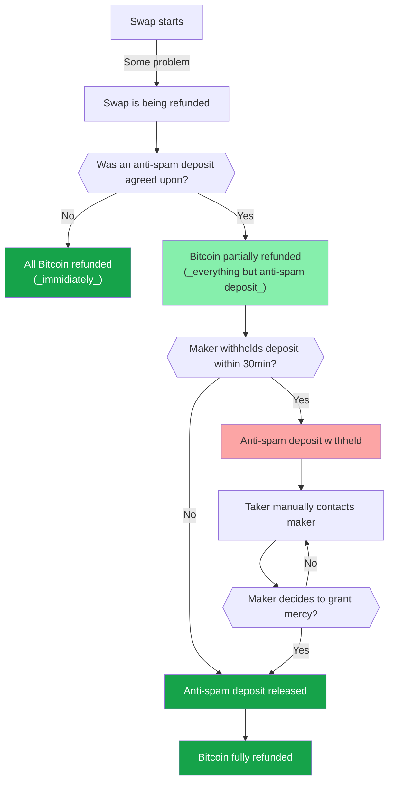

import { Cards } from "nextra/components"

# Anti-spam deposit

See the FAQ for quick answers.

<Cards num={1}>
  <Cards.Card arrow title="FAQ: Anti-spam deposit" href="/faq/anti_spam_deposit">
  </Cards.Card>
</Cards>

## Overview

As an anti-spam measure some makers require a so called "anti-spam deposit".
This boils down to the taker receiving only a partial refund (e.g. 95%) at first.
The remaining 5% will usually be refunded after a short timelock.
The maker can, in rare circumstances, choose to withhold the the remaining 5% (the anti-spam deposit).

## Why?

Previously, takers were always guaranteed a full refund.
While great for user experience, it opened makers up to some problems.
On one hand, it means that users could refund or complete a swap depending on whether the price moves in their favour.
They would essentially use the swap as a Monero call option -- free of charge.
On the other hand, an adversary with very large reserves could "spam" other makers by
starting swaps that use up all of the maker's reserves.
After a time, the adversary could simply refund while having blocked the maker's funds for up to 36h -- for the low cost of a couple of Bitcoin transactions.

Both of these problems arise from the fact that there is no mechanism for makers to attach some sort of cost to refunds.
The anti-spam deposit is our solution to this problem.
It allows makers to impose a small fee on spammers while sparing honst swappers.

The decision to withhold the anti-span deposit is only made when makers have to do it to defend themselves against spam.
They are incentivized to withhold only in rare circustances because it reflects badly on their reputation.
Even if an honest swapper has been inadvertently been affected, the maker can still issue a refund.

