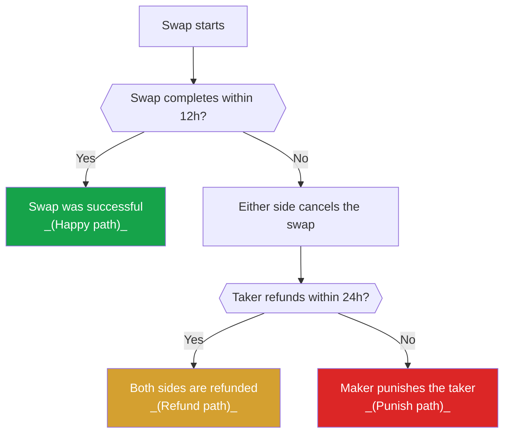

import { Callout, Cards } from 'nextra/components'

# Atomic Swap protocol explained

Atomic swaps enable trustless, peer to peer exchanges across different blockchains.
But how do they work?
And what does the eigenwallet atomic swap protocol look like?

This page explains the flow of an atomic swap using the eigenwallet protocol.

<Callout>
  You don't need to understand the details of the protocol.
  The app will perform all the necessary steps automatically.
</Callout>

## Terminology

For the purpose of the eigenwallet protocol we distinguish between the two parties involved in each swap.
- **Taker** is the side which has Bitcoin and sells these Bitcoin for Monero. _This is you_.
- **Maker** is the side which has Monero and sells these for Bitcoin.

The eigenwallet app will always run as the taker side.
You can use the eigenwallet app to safely exchange _your_ Bitcoin for the _maker's_ Monero.

## Overview

Let's start by having a look at the different paths a swap can take -- the ways it can pan out.
We will skip over the specific transactions for now and focus on the big picture.

Notice that there are three different possible outcomes:

 1. **Happy path**: The swap completes as intended.
    The taker (you), receives the Monero and the maker receives the Bitcoin.
 2. **Refund path**: The swap did not complete, and was refunded. You receive your Bitcoin back. The maker gets their Monero back, too.
 3. **Punish path**: The swap did not complete, but the taker doesn't refund in time.
    The maker can now forcefully take the Bitcoin ("punish").
    The taker might not get access to the Monero anymore.

We will go through the process bit by bit and explain what happens.

## Cancel

_Situation: A swap was started, but was not completed within 12h._

If a swap cannot be completed, then both parties will want their money back.
The first step towards this is to "cancel" the swap.
This happens by publishing the Bitcoin "cancel" transaction.
This transaction was constructed during the swap setup, both parties can publish it.
After the cancel transaction is published, the swap cannot complete normally anymore.

The cancel transaction can only be published after a timelock.
This "cancel timelock" is currently set to 72 Bitcoin confirmations, or ~12 hours.
The cancel transaction does not return the Bitcoin to your wallet.
This will be handled in the next step.

## Refund

_Situation: A swap was started, but was not completed within 12h. The maker subsequently cancelled the swap by publishing the cancel transaction._

As soon as the swap is cancelled, the taker can refund their Bitcoin. 
This is done by publishing another Bitcoin transaction, called the "refund" transaction.
The refund transaction finally returns the Bitcoin back into your wallet.
Only the taker (you) can publish this transaction.
The maker can refund their Monero once you publish the refund transaction.

_But wait -- what happens if the taker doesn't refund?
How will the maker refund their Monero?_

Good catch!
There is indeed no way for the maker to refund their Monero without the taker refunding their Bitcoin first.
Since this is a trustless protocol, the maker needs a safety mechanism.
This mechanism will unlock if the taker has not refunded for 144 Bitcoin blocks (~24h).
This also means **the taker has a limited refund window of ~24h**.
These 24h are specified in the "punish timelock".
The refund window of 144 Bitcoin blocks (~24h) starts with the confirmation of the cancel transaction.

<Callout>
  The app will take care of refunds. It only needs to run for a few minutes at any point during the refund window. You don't need to keep it running.
</Callout>

<Callout type="important">
  The refund window is 24h long and starts 12h after the swap was started.
</Callout>

#### Anti-spam deposit

As an anti-spam measure some makers require a so called "anti-spam deposit".
This boils down to the taker receiving only a partial refund (e.g. 95%) at first.
The remaining 5% will usually be refunded after a short timelock.
The maker can, in rare circumstances, choose to withhold the the remaining 5% (the anti-spam deposit).

Read more on the dedicated pages.

<Cards num={2}>
  <Cards.Card arrow title="Anti-spam deposit" href="/advanced/anti_spam_deposit">
  </Cards.Card>
  <Cards.Card arrow title="FAQ: Anti-spam deposit" href="/faq/anti_spam_deposit">
  </Cards.Card>
</Cards>

## Punish

_Situation: A swap was started, but was not completed within 12h. The maker subsequently cancelled the swap. But even after another 24h the taker still hasn't refunded._

The maker should not lose money due to a taker's fault.
But if the taker does not refund their Bitcoin, the maker cannot refund their Monero.
The solution is the "punish" mechanism.
The maker cannot refund his Monero -- but after the refund window expires the maker can take the Bitcoin.

This means that if you (the taker) don't refund within the refund window, you will lose your Bitcoin.
Once you have been punished, you cannot refund the Bitcoin anymore.
It has been taken by the maker.

At this point, the protocol can no longer guarantee that the taker will get access to the Monero.
But there is still hope.

<Callout type="info">
  Some makers will allow you to recover the Monero even after being punished.
  This is purely voluntary, **do not rely on this**.
</Callout>

## Cooperative Redeem

_Situation: A swap was started, but has subsequently been cancelled. After another 24h the taker still hasn't refunded. The taker has been punished._

If the maker has punished you, you may still be able to complete the swap and receive the Monero.
This requires the maker to cooperate.
Most makers do cooperate, since they do not lose anything.
The alternative would be that the Monero will be locked in the swap forever.

Once you resume the swap, the app will automatically send a request for help to the maker.
If the request fails (e.g. because of network issues), you can still try again later.
There is no time limit for this, but your chances get worse the longer you wait.

If the maker cooperates, the swap will succeed and you will receive the Monero -- as if the swap was always on the happy path.
